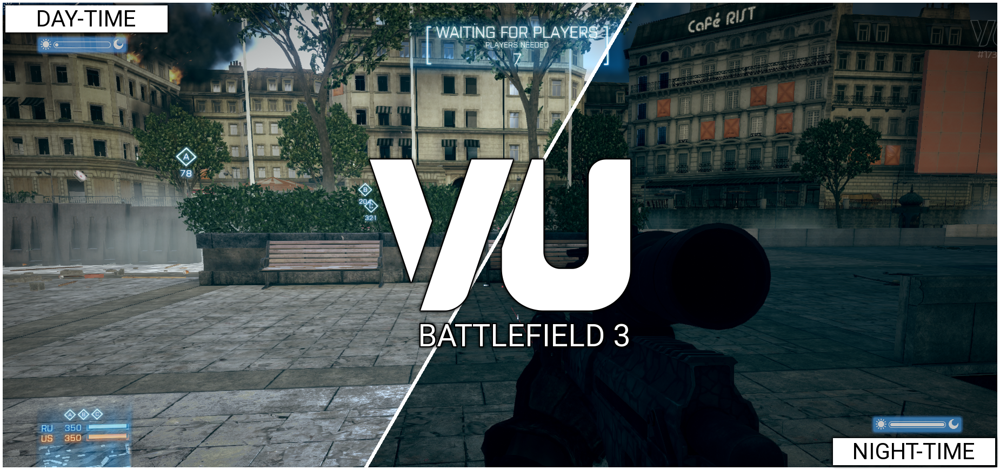

# Day & Night - Live change levels lighting during the game

This is a server mod for [VU](https://veniceunleashed.net/) — a community-oriented Battlefield 3 modding platform — that change the level's lighting during the game, simulating day & night.

## Download/Installation

1. Download the latest zip [vu-mod-day-night-v0.2.zip](https://github.com/GramThanos/bf3-vu-day-night/releases/download/v0.2/vu-mod-day-night-v0.2.zip)
2. Extract the zip into your server's `\Server\Admin\Mods` folder
3. Enable the mod by writing `day-night` in your `ModList.txt` as a new row
4. (Optional) Edit mod options at the `\Server\Admin\Mods\day-night\ext\shared\ticks.lua` file
5. Launch server

## Config

You may change the mod's settings by editing the `ext\shared\ticks.lua` file. Available options to tweak:
- Duration of a full day (default 15 minutes)
- Environment update interval on client (default every 1 second)
- Server synchronization message broadcast interval (default every 10 second)
- Starting hour (default 12am)
- Randomize starting hour (default false)
- Reset datetime on each level (default true)
- Show days on UI indicator (default true)
- Show day period (e.g. Morning) on UI indicator (default true)

## About
The mod was developed by [GramThanos](https://github.com/GramThanos) & [GreatApo](https://github.com/GreatApo).
Credits to [Reirei](https://github.com/rierei/night-time) and [kapraran](https://github.com/kapraran/vu-compass) since code snippets from their work are used.

Leave us a comment if you like at [Venice Unleashed Forum](https://community.veniceunleashed.net/t/day-night-live-change-levels-lighting-during-the-game/1776/4).
